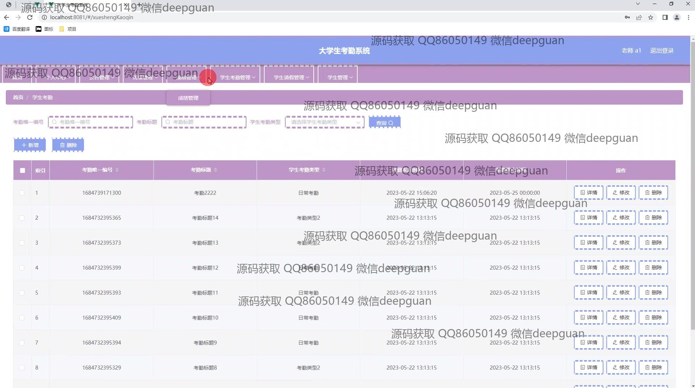

<h1 align="center">基于Java的大学生考勤系统的设计与实现</h1>

## 简介
基于Spring Boot和Java开发的大学生考勤系统，角色涵盖管理员、教师、学生。功能包括学生注册与登录、考勤管理、成绩管理、公告管理、教师信息管理、请假申请与管理、统计报表查看和数据导出等。    --计算机毕业设计源码；毕设源码；java毕业设计源码

## 联系方式

<h3 align="center">获取完整代码与数据库文件 + 微信：deepguan QQ: 86050149 QQ群: 783742310</h3>

<h3 align="center">可帮忙远程部署 包运行成功！提供远程部署、修改代码、设计文档指导、代码讲解等服务！</h3>

## 功能介绍（完整见运行截图）
学生：基本功能包括登录和注册，用户可以通过注册页面填写帐号、密码、班级、姓名、手机号、身份证号和邮箱等信息注册账号。登录后，学生可以查看和修改个人信息，进行请假申请和管理考勤记录。学生页面还包括考勤详情查看、成绩查询和公告阅读等功能，并提供筛选和查询工具以方便操作。

教师：教师可以登录系统后访问个人中心，查看和管理学生考勤记录和成绩信息，页面显示学生的基本信息和考勤类型等。教师可以输入考勤数据，查看历史记录，并通过考试成绩管理界面输入和更新学生成绩。教师还可以通过公告管理模块发布、查看和修改公告信息。

管理员：管理员登录系统后，具有全面的管理权限。功能包括用户管理、年级管理和班级管理等，可以通过界面添加、修改和删除学生与教师的信息。管理员可以访问各模块，如公告管理、考勤管理、成绩管理和假期管理。同时，系统提供功能丰富的导航栏，为管理员提供便捷的操作入口。

公共功能：除了角色特定的功能，系统中提供一些通用功能，如导航栏中的各类展示模块，包括首页、个人中心和统计报表展示。用户可以通过系统的统计功能查看和导出数据，背景设置为云层图像，提供更友好的用户体验。

## 运行截图

本代码来源于网络,仅供学习参考使用!

